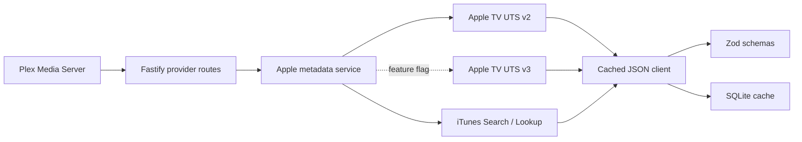

# 🏗️ Architecture

## 🎯 Goal

Provide a small, replaceable integration layer between Plex's custom metadata
provider contract and Apple's film and television catalogue surfaces.

The design favours graceful degradation over pretending that Apple's
undocumented services are stable.



## 🧩 Components

### Plex HTTP boundary

`src/plex/routes.ts` exposes two roots:

- `/movie` supports Plex metadata type `1`.
- `/tv` declares Plex metadata types `2`, `3` and `4`, as Plex requires for a TV
  provider, but the scaffold only implements show-level work today.

Each root advertises:

```json
{
  "Feature": [
    { "type": "metadata", "key": "/library/metadata" },
    { "type": "match", "key": "/library/metadata/matches" }
  ]
}
```

The feature keys remain relative to the provider root, matching Plex's example
provider. Movie and TV identifiers are separate so users can combine each with
other providers independently.

### Normalised domain model

Every adapter maps its upstream response to `AppleMetadata`. Source-specific
identifiers remain namespaced by the `source` field.

The Plex rating key contains a base64url-encoded, schema-validated identity:

```json
{
  "source": "uts-v2",
  "kind": "movie",
  "id": "umc.cmc.example"
}
```

This makes the key safe for Plex's `[a-zA-Z0-9_-]` rating-key constraint while
keeping the original source ID recoverable.

## 🍎 Apple TV UTS v2

The primary adapter mirrors the request family used by Subler:

```text
GET /uts/v2/search/incremental
GET /uts/v2/view/product/{id}
GET /uts/v2/view/show/{id}/episodes
GET /uts/v2/show/{id}/itunesSeasons
```

Current scaffold parameters:

```text
caller=wta
pfm=appletv
utsk=0
v=58
sf={configured storefront}
locale={requested locale}
```

Only search and product detail are implemented. The version and response shape
are undocumented. `UTS_V2_API_VERSION` therefore remains configurable, and
every response crosses a permissive-but-required Zod schema before mapping.

Unknown fields are retained by validation but ignored by the normaliser. A
missing required identity or title fails that source request and allows the
service to continue to the next adapter.

## 🛍️ iTunes Search API fallback

The fallback uses Apple's documented endpoints:

```text
GET https://itunes.apple.com/search
GET https://itunes.apple.com/lookup
```

Movies use `media=movie&entity=movie`. Shows use
`media=tvShow&entity=tvSeason&attribute=showTerm`, then deduplicate results by
Apple artist ID. This resembles Subler's practical workaround for the iTunes
API's season-centred TV model.

Apple documents an approximate limit of 20 calls per minute and recommends
caching. Search responses default to seven days and ID lookups to 30 days.

## 🧪 Optional UTS v3

`ENABLE_UTS_V3=false` by default. When enabled, v3 sits between v2 and iTunes in
the fallback chain.

The adapter first calls:

```text
GET /uts/v3/configurations
```

It schema-validates and reuses the returned `utsk`, `utscf` and `pfm` values for:

```text
GET /uts/v3/search
GET /uts/v3/movies/{id}
GET /uts/v3/shows/{id}
```

This follows Subler's experimental approach and avoids hard-coding rotating
configuration values. It does not make UTS v3 a supported Apple API.

## 💾 Cache

`SqliteCache` uses Node's built-in `node:sqlite` `DatabaseSync` API and a single
table:

```sql
CREATE TABLE cache_entries (
  cache_key TEXT PRIMARY KEY,
  value TEXT NOT NULL,
  expires_at INTEGER NOT NULL,
  updated_at INTEGER NOT NULL
);
```

Keys are SHA-256 hashes of complete upstream URLs. Values store already
validated JSON. A cache hit is validated again before use so an older cached
shape cannot bypass a newer schema. Invalid or corrupt entries are removed and
retried live.

Defaults:

| Data | TTL |
|---|---:|
| Search response, including no results | 7 days |
| Detail or lookup response | 30 days |

The database enables WAL mode for predictable reads during Plex refresh bursts.
It intentionally stores no Plex tokens or Apple credentials.

## 🧱 Schema validation

Validation happens at three boundaries:

1. Environment variables are parsed once in `src/config.ts`.
2. Upstream JSON is size-limited, parsed and validated in
   `CachedJsonClient`.
3. Rating-key identities and Plex match bodies are parsed before use.

Schemas require identity-bearing fields but pass through unknown fields. This
balances drift tolerance with safe mapping.

## 📺 TV hierarchy

Plex expects a TV provider to support:

```text
show
└── season
    └── episode
```

The remaining implementation should:

1. Fetch UTS v2 season summaries from `/view/show/{id}/episodes`.
2. Pair reported season numbers with episode counts without assuming contiguous
   seasons.
3. Encode show ID and season number in stable season rating keys.
4. Page episodes using Plex's `X-Plex-Container-Start` and
   `X-Plex-Container-Size` values.
5. Preserve UTS show, season and episode IDs independently.
6. Build an iTunes fallback from artist → season collection → episode track.
7. Add contract fixtures for specials, split seasons and missing episode
   numbers.
8. Test the complete flow against a supported Plex Media Server before removing
   the deliberate `501` responses.

No synthetic show ID should depend only on a normalised title. Persist any
cross-source mapping so a title or normalisation change cannot rematch an
existing library silently.

## 🧯 Failure behaviour

- UTS v2 empty or invalid: try enabled UTS v3, then iTunes.
- UTS v3 invalid: log a source-scoped warning and try iTunes.
- iTunes empty: return an empty Plex `MediaContainer`.
- Detail source unavailable: return `502` without leaking upstream response
  bodies.
- Invalid Plex body or rating key: return `400`.
- Missing item: return `404`.
- Unimplemented season or episode work: return explicit `501`.

The logger redacts `Authorization` and `X-Plex-Token` request headers.

## ✅ Completion criteria for a production release

- TV children and grandchildren routes pass live Plex integration tests.
- UTS fixtures cover movies, shows, seasons, episodes and missing fields.
- Storefront-to-locale mapping works beyond the configured default.
- Cache hit, miss, age and source fallback metrics are observable.
- Artwork use has an explicit rights decision and remains opt-in if retained.
- The supported PMS version and provider authentication assumptions are
  documented from current Plex behaviour.
